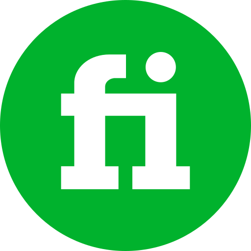
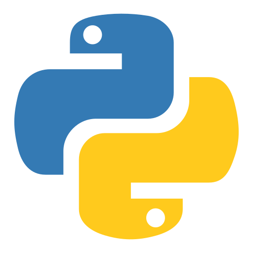

# Hey There!

## **I'm Mukta Choudhury**

 

### ***As a detail-oriented Full-Stack Software Developer with experience in Front-end Development and strong knowledge in Backend Development, I am passionate about enhancing my creativity through sketching and website design.***

### ***My goal is to contribute my skills and creativity to Open Source projects and make a positive impact on society.***

 
 

<h2><b>
CONNECT WITH ME
</b></h2>
<code>
    <a href="https://www.linkedin.com/in/mukta-choudhury/">
        
        LINKEDIN
    </a>
</code>
&nbsp;
<code>
    <a href="https://www.instagram.com/___dusky_bae___/">
        
        INSTAGRAM
    </a>
</code>
&nbsp;
<code>
    <a href="https://www.facebook.com/mukta.choudhury.33">
         FACEBOOK
    </a>
</code>
&nbsp;
<code>
    <a href="https://github.com/mukta2701">
         GITHUB
    </a>
</code>
&nbsp;
<code>
    <a href="https://www.fiverr.com/muktachoudhury/">
         FIVERR
    </a>
</code>

---

<h2><b>
Languages and Tools
</b></h2>
<h4 align="left">Front-end Languages:  
<code>
        
        
        
</code>
</h4>
&nbsp;
<h4 align="right">Back-end Languages:  
<code>
    
    
    
</code>
</h4>
 
<h4 align="left">Framework:  
<code>
    
</code>
</h4>
